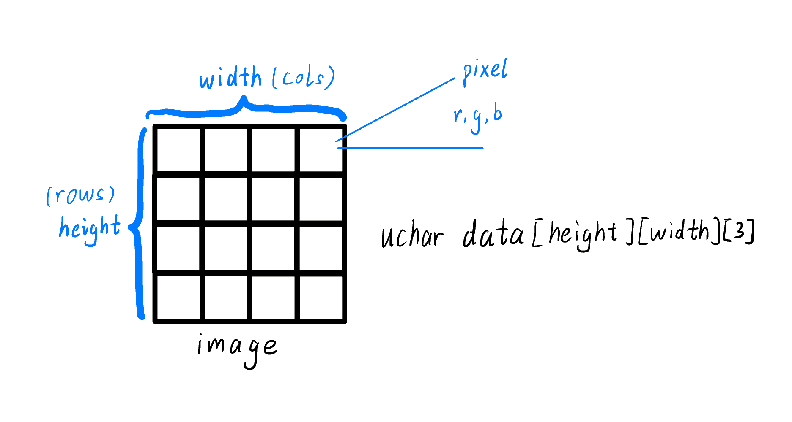

# stb-image-resize

The image is scaled using interpolation:

- bicubic (4x4)
- biakima (6x6) 
- biline (2x2) 

## build

### load submodules

submodules:
- [stb](https://github.com/nothings/stb.git) -> [src/stb](src/stb)

```shell
$ git submodule update
```

### install dependencies

build dependencies:

- build-essential
- cmake

```shell
$ sudo apt-get install build-essential cmake
```

### compilation
```shell
$ mkdir build
$ cd build
$ cmake ..
$ make
```
## use

The first and second parameters specify the paths to the image and the result {PNG}. The third parameter specifies the scale of the image. The fourth specifies the scaling method {0 - bicubic, 1 - biakima, -1 - biline}.
```shell
./stbresize -r 4 ${IMAGE_PATH} ${IMAGE_PATH}.out.png
```

## structure

- `biakima.h` - biakima image scaling
- `bicubic.h` - bicubic image scaling
- `biline.h` - biline image scaling
- `image-stb.h` - API [stb](https://github.com/nothings/stb.git)
- `ris.h` - Reverse Interpolate Scale (RIS): prefilter
- `stb/` - [stb](https://github.com/nothings/stb.git)
- `stbresize.c` - CLI program.

## image scaling

Use bicubic or biakima interpolation method to scale the image. The principle is: for each pixel in the scaled image, find the nearest 4x4 or 6x6 pixel grid at the corresponding position in the original image, and use this grid to perform interpolation to obtain RGB of this pixel. See `bicubic.h` or `biakima.h` for details.

Regarding the principle of zooming by the bicubic interpolation method, it is not expanded here, so you can ignore it.

Use the [stb image library](https://github.com/nothings/stb.git) for processing, you can ignore it.

After reading in the picture, a 3-channel pixel matrix is obtained, that is, the RGB of each pixel is arranged together, each occupying a byte.

The layout of images in memory is shown in the figure:  

